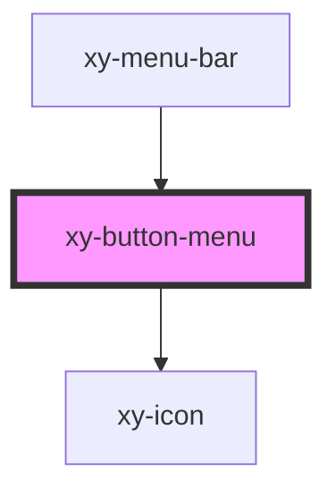

# xy-button-menu

<!-- Auto Generated Below -->

## Properties

| Property   | Attribute | Description | Type             | Default         |
| ---------- | --------- | ----------- | ---------------- | --------------- |
| `menuData` | --        |             | `IMenuItemProps` | `{ props: {} }` |

## Dependencies

### Used by

 - [xy-menu-bar](../xy-menu-bar)

### Depends on

- [xy-icon](../xy-icon)

### Graph

----------------------------------------------

*Built with [StencilJS](https://stenciljs.com/)*
