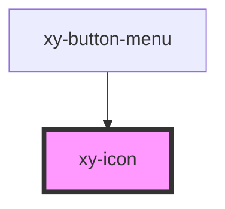

# xy-icon

<!-- Auto Generated Below -->

## Properties

| Property | Attribute | Description | Type                            | Default     |
| -------- | --------- | ----------- | ------------------------------- | ----------- |
| `height` | `height`  |             | `number \| string \| undefined` | `16`        |
| `name`   | `name`    |             | `string \| undefined`           | `undefined` |
| `width`  | `width`   |             | `number \| string \| undefined` | `16`        |

## Dependencies

### Used by

 - [xy-button-menu](../xy-button-menu)

### Graph

----------------------------------------------

*Built with [StencilJS](https://stenciljs.com/)*
