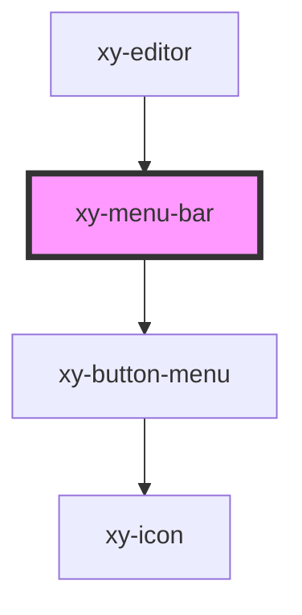

# xy-menu-bar

<!-- Auto Generated Below -->

## Properties

| Property  | Attribute  | Description | Type                  | Default     |
| --------- | ---------- | ----------- | --------------------- | ----------- |
| `editor`  | --         |             | `Editor \| undefined` | `undefined` |
| `menuBar` | `menu-bar` |             | `any`                 | `undefined` |

## Dependencies

### Used by

 - [xy-editor](../..)

### Depends on

- [xy-button-menu](../xy-button-menu)

### Graph

----------------------------------------------

*Built with [StencilJS](https://stenciljs.com/)*
