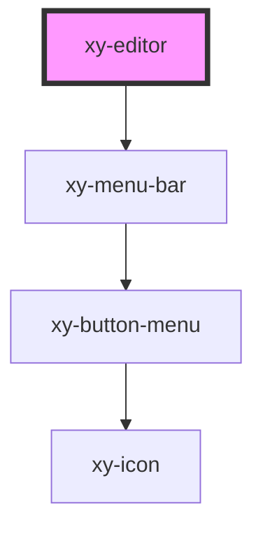

# xy-editor

<!-- Auto Generated Below -->

## Properties

| Property      | Attribute     | Description | Type       | Default                                                                                                                                                                                                                                                                                                                                                                                                                                                        |
| ------------- | ------------- | ----------- | ---------- | -------------------------------------------------------------------------------------------------------------------------------------------------------------------------------------------------------------------------------------------------------------------------------------------------------------------------------------------------------------------------------------------------------------------------------------------------------------- |
| `bubbleBar`   | --            |             | `string[]` | `['bold', 'italic']`                                                                                                                                                                                                                                                                                                                                                                                                                                           |
| `content`     | `content`     |             | `string`   | `''`                                                                                                                                                                                                                                                                                                                                                                                                                                                           |
| `excludeBar`  | --            |             | `string[]` | `['fontFamily']`                                                                                                                                                                                                                                                                                                                                                                                                                                               |
| `extensions`  | --            |             | `any[]`    | `[]`                                                                                                                                                                                                                                                                                                                                                                                                                                                           |
| `language`    | `language`    |             | `string`   | `'en'`                                                                                                                                                                                                                                                                                                                                                                                                                                                         |
| `menuBar`     | --            |             | `string[]` | `[     'bold',     'italic',     'strike',     'underline',     'subscript',     'superscript',     'link',     '\|',     'heading',     'fontFamily',     '\|',     'highlight',     'fontColor',     '\|',     'blockquote',     'code',     'codeBlock',     '\|',     'textAlign',     'lineHeight',     'hardBreak',     'horizontalRule',     'orderedList',     'bulletList',     'taskList',     '\|',     'table',     'image',     'fullScreen'   ]` |
| `placeholder` | `placeholder` |             | `string`   | `'请输入内容'`                                                                                                                                                                                                                                                                                                                                                                                                                                                      |
| `theme`       | `theme`       |             | `string`   | `'light'`                                                                                                                                                                                                                                                                                                                                                                                                                                                      |

## Dependencies

### Depends on

- [xy-menu-bar](./components/xy-menu-bar)

### Graph

----------------------------------------------

*Built with [StencilJS](https://stenciljs.com/)*
